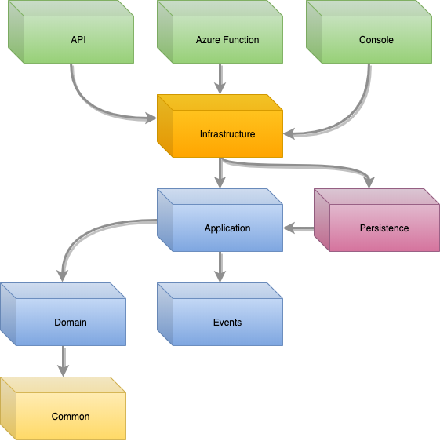

# Clean Architecture Templates

 [](https://caseycrouse.visualstudio.com/Github/_build/latest?definitionId=4) [](https://www.nuget.org/packages/CleanArchitecture.Templates/) [](https://www.nuget.org/stats/packages/CleanArchitecture.Templates?groupby=Version)

_Keep your application code free of dependencies like persistence and presentation._

Welcome to my rendition of Jason Taylor's [Clean Architecture Template](https://github.com/jasontaylordev/CleanArchitecture)! I was first inspired by Jason's [first video](https://www.youtube.com/watch?v=_lwCVE_XgqI&t=4s) where Clean Architecture was presented in a .NET Core application which has been updated in his [most recent video](https://www.youtube.com/watch?v=5OtUm1BLmG0). I used this solution structure, patterns, and principles to build several production-ready microservices. What came of that, was the ability to **orchestrate an application's startup process** using any presentation, ensuring that an application's dependencies and behavior remains consistent.

---

##  Getting Started

### Installation

Run the command:

```powershell
dotnet new -i CleanArchitecture.Templates
```

### Templates

* **ca-sln** - A simple application with three separate presentations
* **ca-sln-sql** (Coming soon!) - Includes an entity framework core implementation using an in-memory datastore
* **ca-sln-mongo** (Coming soon!) - Includes a mongo db implementation

### Create a template

```powershell
dotnet new ca-sln --app-name MyNewApp --secure-port 44399 --port 34399
```

---

##  Clean Architecture, Domain-Driven Design, MediatR, & AutoMapper

[This article](https://pusher.com/tutorials/clean-architecture-introduction) does a great job expanding upon Clean Architecture. If you haven't already, I highly recommend picking up a copy of [Clean Architecture](https://www.amazon.com/Clean-Architecture-Craftsmans-Software-Structure/dp/0134494164) by Robert C. Martin.

If you so choose, [Domain-Driven Design](https://docs.microsoft.com/en-us/dotnet/architecture/microservices/microservice-ddd-cqrs-patterns/ddd-oriented-microservice) excels in this solution structure and makes for great microservices. Of course, a monolithic application is still a reasonable solution to many problems.

[MediatR](https://github.com/jbogard/MediatR) is a 3rd party library that allows you to truly separate your presentation layer from your application layer. For an API or MVC presentation, your controllers become wildly simplified. For a console application, it becomes very easy to do create custom functionality for maintenance or customer support tasks on-the-fly. For an Azure Function, the most you have to worry about is what trigger you are going to use.

[AutoMapper](https://github.com/AutoMapper/AutoMapper) adds a nice convenience to translating your presentation models into the contract requirements for the application, domain, or persistence.

---

##  Solution Overview

Below is a diagram and several descriptions to help you understand the layout of the solution and why assemblies have certain dependencies and why other dependent relationships must not exist.

### Dependency Diagram

<p align="center">
    
</p>

*  Presentation Layer - Depends only on Infrastructure
*  Infrastructure Layer - Depends on Application and Persistence
*  Persistence Layer - Depends on Application
*  Business Layer - Application must ONLY depend on Domain and Events. Common is the only exception for shareable code.
*  Common Layer - No direct dependencies

### Assembly Responsibilities

* **API** - Provides presentation-specific dependency registrations through `PresentationStartupOrchestrator<TOrchestrator>`.
* **Azure Function** - Provides presentation-specific dependency registrations through `FunctionStartupOrchestrator<TOrchestrator>`. Azure Functions have a different startup because it requires inheriting `FunctionStartup`.
* **Console** - Provides presentation-specific dependency registrations through `PresentationStartupOrchestrator<TOrchestrator>`.
* **Infrastructure** - Handles dependency registrations for the application and persistence as well as 3rd party integration implementations such as HTTP Clients.
* **Persistence** - Provides implementation details for persistence related interfaces in the application.
* **Application** - Provides the dependency-free core business logic.
* **Domain** - Provides the domain entities, enumerations, exceptions, constants, etc.
* **Events** - Provides event-specific models and produces a NuGet package that can be consumed by other services that want to subscribe to these events.
* **Common** - Provides shared code such as string or system extensions. This assembly can be referenced by all other assemblies.

### Application Folder Layout

```csharp
configuration
// Contains configuration IOptions classes specific to application

entity
// User
    |---Commands
    // CreateUserCommand.cs
    |---Handlers
    // CreateUserHandler.cs
    // GetUserHandler.cs
    |---Queries
    // GetUserQuery.cs
    |---Validators
    // CreateUserValidator.cs
    // GetUserValidator.cs

interfaces
// Contains interfaces that the application depends on

mapping
// Contains 'request <-> domain' AutoMapper profiles or mapping actions
```

### Domain Folder Layout

```csharp
entities
// Contains the domain entity models

constants
// Contains enumerations and constants

exceptions
// Contains custom exceptions
```

### Events Folder Layout

```csharp
entity
// User
    |---Models
    // Address.cs
// UserCreated.cs
// UserUpdated.cs
// UserDeleted.cs
```

### Infrastructure Folder Layout

```csharp
configuration
// Contains configuration IOptions classes specific to infrastructure

extensions
// Contains infrastructure-specific extensions classes

services
// Contains non-persistence implementations for application interfaces

startup
// Startup orchestrator classes
```

### Persistence Folder Layout

```csharp
configuration
// Contains configuration IOptions classes specific to persistence

entity
// User - data access implementations

mapping
// Contains 'persistence <-> domain' AutoMapper profiles and mapping actions
```

### API Folder Layout

```csharp
configuration
// Contains configuration IOptions classes specific to the presentation

controllers
// Contains API controllers

mapping
// Contains 'presentation <-> request' AutoMapper profiles and mapping actions

```

> Console and Azure Function have similar folder layouts to API. However, Microsoft recommends that each function in the Function App exist in its own folder. See [Azure Function Best Practices](https://docs.microsoft.com/en-us/azure/azure-functions/functions-best-practices).

---

##  Contributing

Want to add a feature or fix a bug? Glad to have the help! There's just a couple of things to go over before you start submitting pull requests:

* [Commit Message Standards](./docs/commit_message_standards.md)
* [Branching Strategies](./docs/branching_strategies.md)

---

##  Licensing

These templates are licensed under the [MIT License](./LICENSE).
